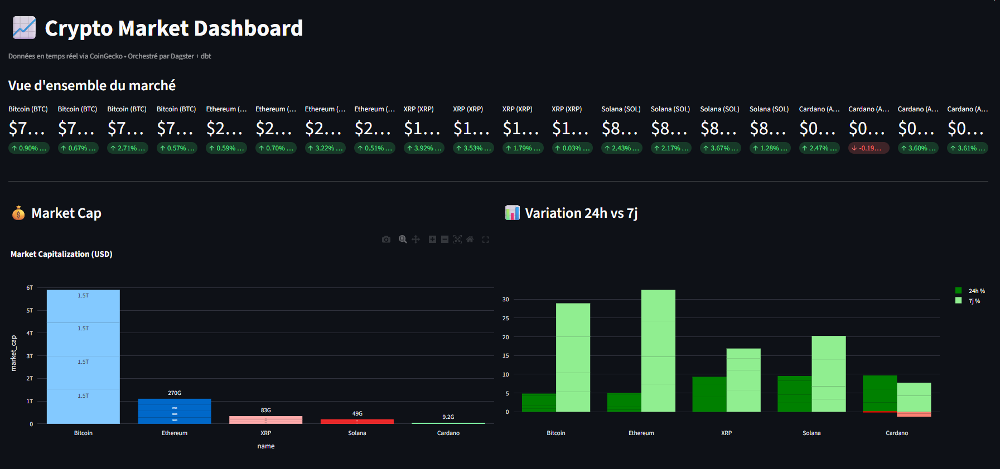
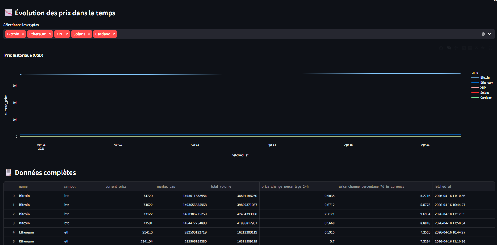

# Dagster Crypto Pipeline

> Pipeline de données end-to-end pour le suivi des marchés crypto en temps réel — orchestré par **Dagster**, transformé par **dbt**, stocké dans **DuckDB**, visualisé avec **Streamlit**.


---

## Objectif du projet

Ce projet implémente une **pipeline de données complète** (ETL) qui :

1. **Extrait** les prix et métriques de marché de 5 cryptomonnaies (BTC, ETH, SOL, ADA, XRP) depuis l'API publique **CoinGecko**
2. **Stocke** les données brutes dans une base **DuckDB** locale
3. **Transforme** les données via des modèles **dbt** (staging → marts)
4. **Visualise** les tendances et KPIs dans un **dashboard Streamlit** interactif
5. **Orchestre** le tout avec **Dagster** : jobs, schedules horaires, sensors d'alerte

---

## 🏗️ Architecture

```
┌─────────────────────────────────────────────────────────────┐
│                        DAGSTER                              │
│                                                             │
│  ┌──────────────┐    ┌──────────────┐    ┌──────────────┐  │
│  │   EXTRACT    │───▶│     LOAD     │───▶│  TRANSFORM   │  │
│  │  CoinGecko   │    │   DuckDB     │    │     dbt      │  │
│  │     API      │    │  (raw data)  │    │  (staging +  │  │
│  └──────────────┘    └──────────────┘    │    marts)    │  │
│                                          └──────────────┘  │
│                                                    │        │
│  ┌──────────────────────────────────────────────── ▼ ────┐  │
│  │              VISUALIZE — Streamlit Dashboard          │  │
│  └───────────────────────────────────────────────────────┘  │
│                                                             │
│  Automation : Schedule (toutes les heures)                  │
│               Sensor (alerte chute > 5%)                    │
└─────────────────────────────────────────────────────────────┘
```

### Stack technique

| Composant       | Technologie       | Rôle                                      |
|-----------------|-------------------|-------------------------------------------|
| Orchestration   | **Dagster**        | Pipeline, jobs, schedules, sensors        |
| Extraction      | **Python/Requests**| Appels API CoinGecko                      |
| Stockage        | **DuckDB**         | Base de données analytique locale         |
| Transformation  | **dbt-core**       | Modèles SQL staging et marts              |
| Intégration     | **dagster-dbt**    | Assets dbt exposés dans Dagster           |
| Visualisation   | **Streamlit**      | Dashboard interactif                      |
| Tests           | **pytest**         | Tests unitaires des assets et transforms  |
| Conteneurisation| **Docker Compose** | Déploiement reproductible                 |

---

## Structure du projet

```
dagster-crypto-pipeline/
│
├── dagster_pipeline/               # Package principal Dagster
│   ├── __init__.py
│   ├── definitions.py              # Point d'entrée : assets, jobs, schedules, sensors
│   ├── jobs.py                     # Définition du job principal
│   ├── schedules.py                # Schedule horaire
│   ├── sensors.py                  # Sensor d'alerte sur chute de prix
│   ├── assets/
│   │   ├── extract.py              # Asset : appel API CoinGecko → DuckDB
│   │   └── dbt_assets.py           # Assets : modèles dbt auto-générés
│   └── resources/
│       └── database.py             # Ressource DuckDB (ConfigurableResource)
│
├── dbt_project/
│   └── crypto_pipeline/            # Projet dbt
│       ├── models/
│       │   ├── staging/
│       │   │   └── stg_crypto_prices.sql     # Nettoyage données brutes
│       │   └── marts/
│       │       └── crypto_market_summary.sql # Table analytique finale
│       ├── dbt_project.yml
│       └── profiles.yml            # Connexion DuckDB
│
├── dashboard/
│   └── app.py                      # Dashboard Streamlit
│
├── tests/
│   ├── test_extract.py             # Tests de l'asset d'extraction
│   └── test_transforms.py          # Tests des transformations
│
├── data/                           # Fichier DuckDB (gitignored)
├── .env                            # Variables d'environnement
├── docker-compose.yml
├── Dockerfile
├── requirements.txt
└── README.md
```

---

## Installation & Démarrage

### Prérequis

- Python 3.11+
- Git
- Docker & Docker Compose
- DBT 1.11

### 1. Cloner le repo

```bash
git clone https://github.com/TON_USERNAME/dagster-crypto-pipeline.git
cd dagster-crypto-pipeline
```

### 2. Créer l'environnement virtuel

```bash
python -m venv .venv

# l'activer
.venv\Scripts\activate
```

### 3. Installer les dépendances

```bash
pip install -r requirements.txt
```

### 4. Générer le manifest dbt

```bash
cd dbt_project/crypto_pipeline
dbt compile
cd ../..
```

### 5. Créer le dossier data

```bash
mkdir data
```

---

## Lancer le projet

### Dagster (orchestrateur)

```bash
dagster dev -f dagster_pipeline/definitions.py
```

Ouvre **http://localhost:3000** dans le navigateur.

#### Dans l'UI Dagster :
1. Va dans **Catalog** → sélectionne tous les assets → clique **Materialize all**
2. Va dans **Automation** → active le toggle de `hourly_crypto_schedule` et `price_drop_sensor`

### Dashboard Streamlit

Dans un second terminal (avec le venv activé de préférence) :

```bash
streamlit run dashboard/app.py
```

Ouvre **http://localhost:8501**

---

## Docker

```bash
docker-compose up --build
```

Services exposés :
- Dagster UI → http://localhost:3000
- Streamlit → http://localhost:8501

---

## Pipeline Dagster en détail

### Assets

| Asset                  | Groupe     | Type    | Description                                      |
|------------------------|------------|---------|--------------------------------------------------|
| `raw_crypto_prices`    | ingestion  | Python  | Récupère les prix depuis l'API CoinGecko         |
| `stg_crypto_prices`    | default    | dbt     | Nettoyage et typage des données brutes           |
| `crypto_market_summary`| default    | dbt     | Table agrégée prête pour le dashboard            |

### Automation

| Nom                      | Type     | Déclencheur                          |
|--------------------------|----------|--------------------------------------|
| `hourly_crypto_schedule` | Schedule | Toutes les heures (`0 * * * *`)      |
| `price_drop_sensor`      | Sensor   | Si une crypto chute de plus de 5%    |

### Modèles dbt

```
raw_crypto_prices (DuckDB)
        │
        ▼
stg_crypto_prices       ← vue : nettoyage, cast des types
        │
        ▼
crypto_market_summary   ← table : tri par market cap, prête pour Streamlit
```

---

## Tests

```bash
pytest tests/ -v
```

Les tests couvrent :
- La structure et le typage du DataFrame retourné par l'API
- La présence des colonnes requises
- La gestion des erreurs réseau (mock)
- La logique de transformation

---

## Dashboard

Le dashboard Streamlit affiche :

- **KPI cards** : prix actuel + variation 24h par crypto
- **Market Cap** : bar chart comparatif
- **Variation 24h vs 7j** : bar chart groupé
- **Évolution historique** : line chart filtrable par crypto
- **Table de données** : vue complète des dernières valeurs

---

## Choix de conception

### Pourquoi DuckDB ?
DuckDB est une base analytique embarquée, idéale pour ce type de projet : pas de serveur à démarrer, performances excellentes sur des requêtes analytiques, et intégration native avec Python et dbt.

### Pourquoi dbt ?
dbt apporte la rigueur du génie logiciel aux transformations SQL : modèles versionnés, tests natifs (`not_null`, `unique`), documentation auto-générée et séparation claire entre les couches `staging` et `marts`.

### Pourquoi Dagster plutôt qu'Airflow ?
Dagster adopte une approche **asset-centric** : on définit ce que les données *sont* plutôt que ce que le pipeline *fait*. Cela donne une meilleure observabilité, une gestion du lignage des données et une intégration native avec dbt.

---
### Athoured By me


### Apercu du projet 


